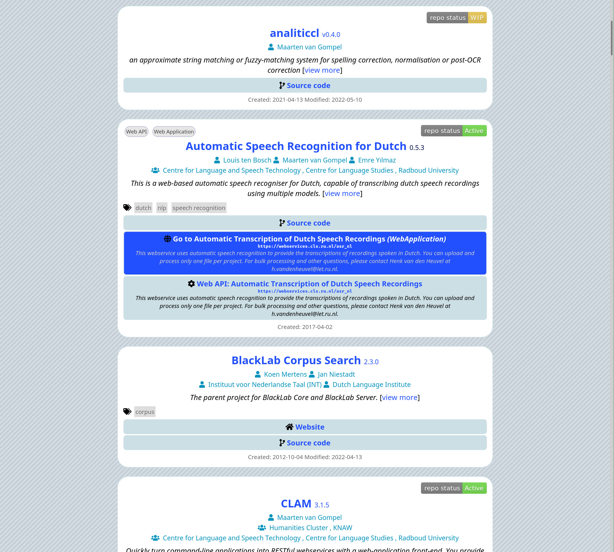
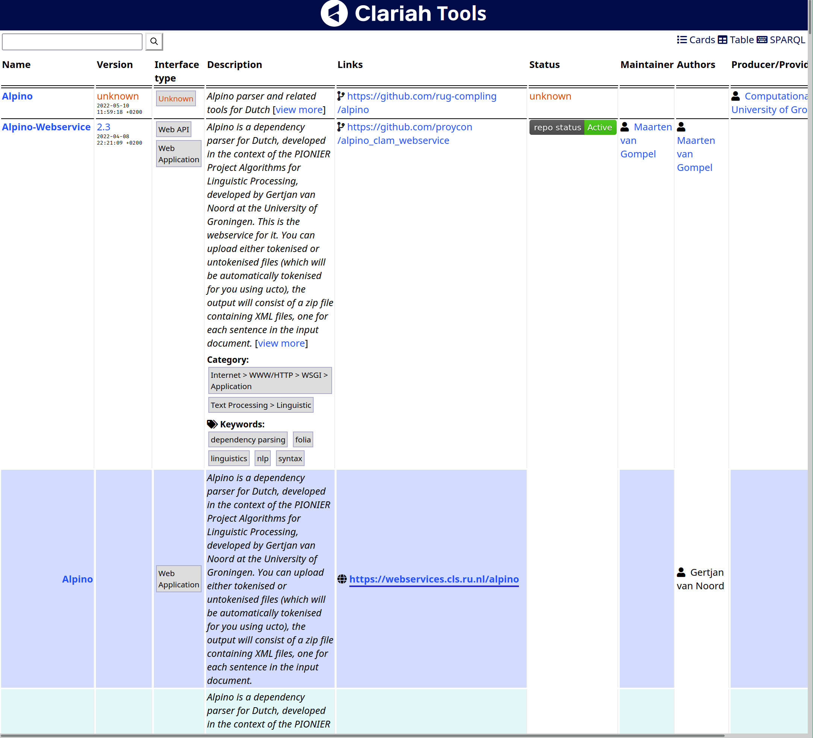
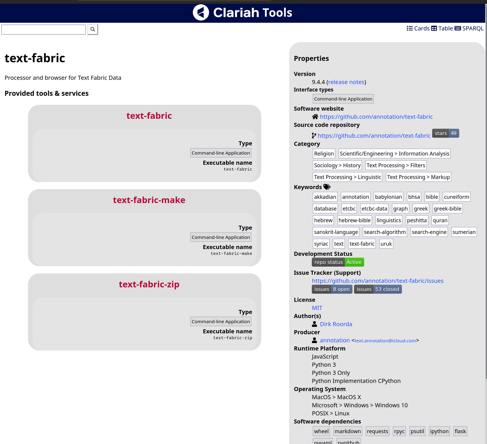
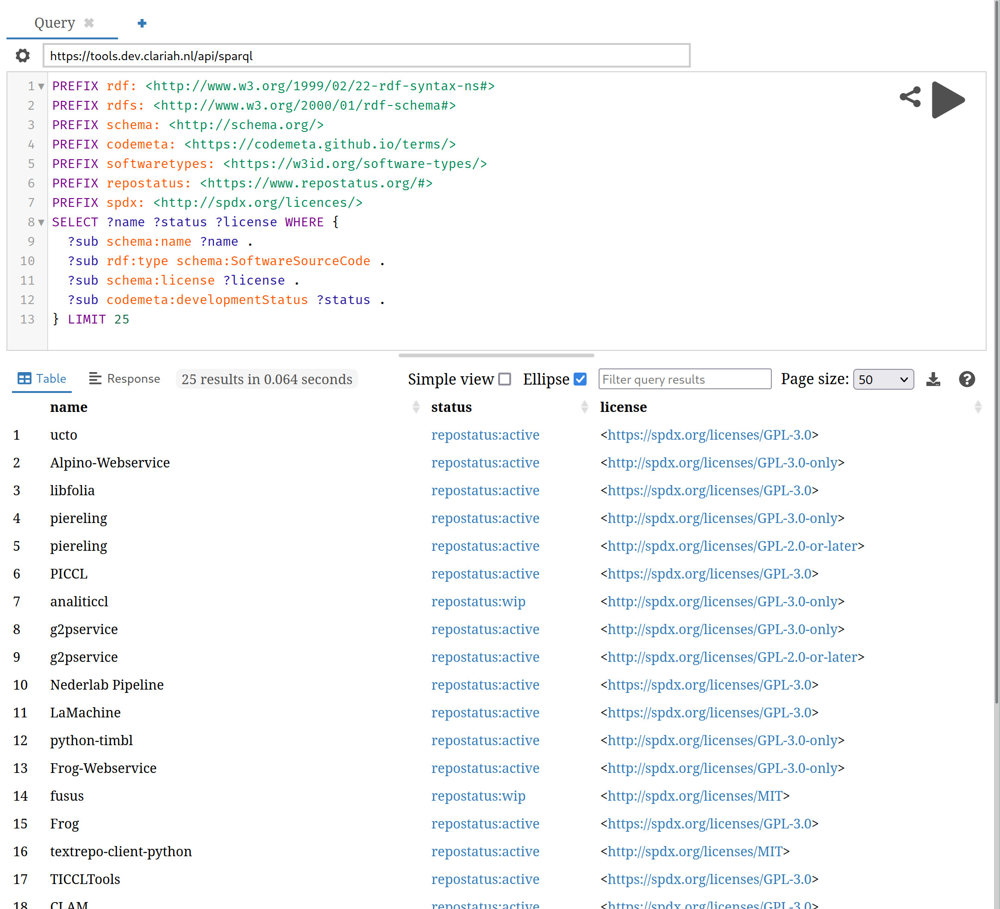

# Codemeta Server

Codemeta server provides a simple portal to software tools, based on software
metadata in [codemeta](https://codemeta.github.io) and
[schema.org](https://schema.org). It is implemented as an in-memory RDF triple
store and provides an API (including SPARQL endpoint) for querying. It builds
upon the [codemetapy](http://github.com/proycon/codemetapy) library, which
implements most of the functionality. Automatic harvesting of software metadata
can be accomplished via [codemeta-harvester](https://github.com/proycon/codemeta-harvester).

Features:

* Web-user interface for end-users
    * Index of tools ('card' view and table view)
    * Per-tool pages
    * Integrates some badges (aka shields) like for GitHub, Repostatus
* Simple search/query facilities
* Advanced query facilities using SPARQL:
    * SPARQL endpoint
    * [YASGUI](https://github.com/TriplyDB/YASGUI) front-end for end-users.
* JSON-LD and turtle serialisations for all data, full support for content negotiation
* Supports various extensions to codemeta:
    * [Software Types and Services](https://github.com/proycon/codemetapy#software-types-and-services)

This software is developed in the scope of the [CLARIAH-PLUS project](https://clariah.nl), a
`Dockerfile`  for the CLARIAH Tool Discovery pipeline, including both the
harvester and this server and API powering the CLARIAH Tool Store, can be found
here: https://github.com/CLARIAH/tool-discovery .

## Installation

`pip install codemeta-server`

## Usage

In development scenarios, you can run `codemeta-server` as follows:
`
codemeta-server --graph data.json --baseuri https://tools.dev.clariah.nl/ --baseurl http://localhost:8080/ --port 8080
`
Check ``codemeta-server --help`` for help on all the options.

The file `data.json` is produced by [codemetapy](https://github.com/proycon/codemetapy_ (usually via codemeta-harvester) and contains the full linked data graph of all tools you want to show.
Say you have ``codemeta.json`` files for  two resources, then you can use codemetapy to create a graph as follows:

``
codemetapy --graph resource1.codemeta.json resource2.codemeta.json > data.json
``

If you have no codemeta files at all yet, then you can use codemetapy (via
[codemeta-harvester](https://github.com/proycon/codemeta-harvester) to automatically extract metadata.

For production scenarios, you'll want to run codemeta-server via WSGI/ASGI, check the Dockerfile in https://github.com/CLARIAH/tool-discovery .

## Screenshots

Excerpt of a tool index in the default 'card' view:

Excerpt of a tool index in the table view:

An example page for a specific tool:

The SPARQL frontend (Yasgui):

